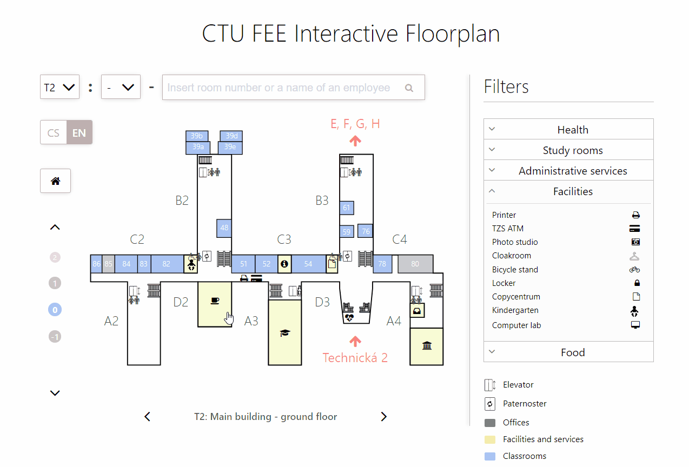

:exclamation: This a product of a bachelor thesis and the repo serves only as an archive, current version is being maintained elsewhere

# Interactive Floorplans for CTU FEE in Prague

Single-page web-application built on MERN Stack ([MongoDB](https://www.mongodb.com/), [Express](https://expressjs.com/), [React](https://reactjs.org/) and [Node.js](https://nodejs.org/en/)) with [TypeScript](https://www.typescriptlang.org/), which is meant to provide a platform for easier orientation in buildings of CTU FEE, especially for newcoming students and visitors. 

  

The floorplans show locations of classrooms, facilities and services or offices. Offices of teachers and other personel are searched via [Usermap API](https://rozvoj.fit.cvut.cz/Main/usermap-api).

  

### Pathfinding

The app also provides a simple pathfinding solution implemented using modified [A*](https://en.wikipedia.org/wiki/A*_search_algorithm) search algorithm, which finds a path between any two points on a map.

  

The search can be set to find only such paths, that would be accessible to people with limited mobility.

  

